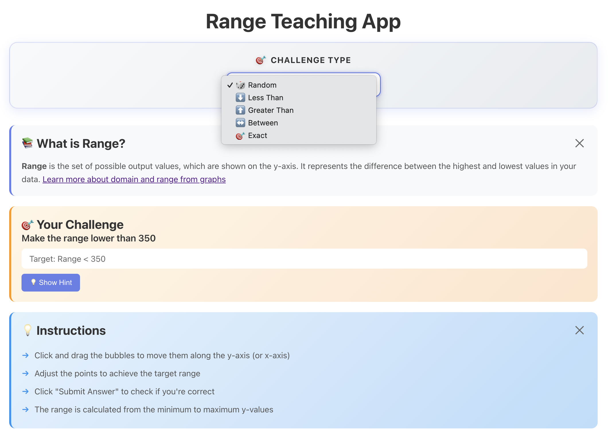

# Range Teaching App

A web application that teaches the concept of "Range" in data visualization through an interactive bubble graph.

## Live Demo

🌐 **Deployed Application**: [https://range-teaching-app.vercel.app/](https://range-teaching-app.vercel.app/)




## Tech Stack

- **Frontend**: React 18.2.0 with JSX components and CSS Modules
- **Backend**: Django 4.2.7 with Django REST Framework
- **Visualization**: Recharts 2.10.3
- **HTTP Client**: Axios

## Prerequisites

Before you begin, ensure you have the following installed:

- **Python** 3.8 or higher
- **Node.js** 14.x or higher and **npm** (or **yarn**)
- **Git** (for cloning the repository)

## Features

### Core Functionality
- **Interactive Bubble Graph**: Based on "Metro Systems of the World" dataset with drag-and-drop functionality
- **Dynamic Point Manipulation**: Move data points along x and y axes by clicking and dragging
- **Real-time Range Calculation**: Automatically calculates and displays current range as you move points

### Challenge System
- **18 Different Challenge Types** across 4 categories:
  - **Less Than** (5 variations): Achieve range lower than specified values (200, 250, 300, 350, 400)
  - **Greater Than** (5 variations): Achieve range greater than specified values (200, 250, 300, 350, 400)
  - **Between** (4 variations): Achieve range within specified intervals
  - **Exact** (4 variations): Match exact min and max values
- **Challenge Type Selector**: Choose specific challenge type or get random challenges
- **Challenge Filtering**: Filter challenges by type via API query parameter

### Learning & Guidance
- **Interactive Tutor Component**:
  - Collapsible "What is Range?" section with educational content
  - Challenge display with target requirements
  - Context-aware hints system that provides real-time guidance
  - Collapsible instructions section
  - External links to learn more about domain and range
- **Smart Hints**: Dynamic hints that adapt based on current range and challenge type

### Feedback & Statistics
- **Real-time Feedback**: Immediate validation with detailed feedback messages
- **Celebration Animations**: Visual celebrations (confetti, emojis) on correct answers
- **Range Information Display**: Shows current min, max, and calculated range
- **Statistics Dashboard**:
  - Completed challenges counter
  - Total challenges attempted
  - Success rate percentage
  - Persistent storage using localStorage
- **Export Statistics**: Download statistics as JSON file
- **Reset Statistics**: Clear all statistics with one click
- **Attempts Counter**: Track number of attempts per challenge

### User Experience
- **Modern UI Design**: Beautiful gradient backgrounds, smooth animations, and hover effects
- **Error Handling**: User-friendly error messages with dismiss functionality
- **Reset Functionality**: Reset graph to initial state while keeping challenge active
- **Loading States**: Visual feedback during data loading
- **Responsive Design**: Works across different screen sizes
- **Custom Styling**: CSS Modules for component-scoped styles

## Installation

### Quick Start

You can use the provided shell scripts for quick setup:

**Backend:**
```bash
./scripts/start_backend.sh
```

**Frontend (in a new terminal):**
```bash
./scripts/start_frontend.sh
```

### Manual Setup

#### Backend Setup

1. Navigate to the backend directory:
```bash
cd backend
```

2. Create a virtual environment (recommended):
```bash
python3 -m venv venv
source venv/bin/activate  # On Windows: venv\Scripts\activate
```

3. Install dependencies:
```bash
pip install -r requirements.txt
```

4. Create `.env` file for environment variables:
```bash
# Copy example file
cp ../.env.example .env
# Edit .env with your values (or use defaults)
```

5. Run migrations (creates tables for Django's built-in apps like sessions, auth, etc.):
```bash
python manage.py migrate
```

6. Start the Django server:
```bash
python manage.py runserver
```

The backend will be available at `http://localhost:8000`

**Note**: The `.env` file is optional. If not present, the app will use default values from `settings.py`.

#### Frontend Setup

1. Navigate to the frontend directory:
```bash
cd frontend
```

2. (Optional) Create `.env` file for environment variables:
```bash
# Create .env file
echo "REACT_APP_API_BASE_URL=http://localhost:8000/api" > .env
```

3. Install dependencies:
```bash
npm install
```

4. Start the React development server:
```bash
npm start
```

The frontend will be available at `http://localhost:3000`

**Note**: The `.env` file is optional. If not present, the app will use `http://localhost:8000/api` as default.

## Usage

### Getting Started

1. **Start both servers**: Backend on port 8000 and frontend on port 3000
2. **Open the application**: Navigate to `http://localhost:3000` in your browser
3. **Learn about Range**: Expand the "What is Range?" section in the Tutor component
4. **Read instructions**: Check the collapsible Instructions section for detailed guidance

### Working with Challenges

1. **Select Challenge Type** (optional):
   - Use the Challenge Type selector to choose a specific type (Less Than, Greater Than, Between, Exact)
   - Or select "Random" to get a random challenge
   - Changing the type automatically loads a new challenge

2. **Understand the Challenge**:
   - Read the challenge description in the Tutor section
   - View the target requirements (e.g., "Range < 300")
   - Click "💡 Show Hint" for contextual guidance

3. **Manipulate the Graph**:
   - Click and drag bubbles to move them along the y-axis (or x-axis)
   - Watch how the range changes as you move points
   - Use hints to guide your adjustments

4. **Submit Your Answer**:
   - Click "Submit Answer" to validate your solution
   - View immediate feedback with detailed range information
   - See celebration animations if correct!

5. **Continue Learning**:
   - If incorrect, adjust points and try again (attempts are tracked)
   - If correct, click "Try Another Challenge" for a new challenge
   - Use "Reset" to restore initial graph state without changing the challenge

### Tracking Progress

- **View Statistics**: Check the statistics dashboard for:
  - Number of completed challenges
  - Total challenges attempted
  - Your success rate percentage
- **Export Data**: Click "📥 Export JSON" to download your statistics
- **Reset Stats**: Click the "🔄" button to clear all statistics
- **Monitor Attempts**: See how many attempts you've made for the current challenge

### Tips

- Use hints when stuck - they provide contextual advice based on your current range
- Collapse sections you don't need to focus on the graph
- Try different challenge types to practice various range concepts
- Statistics persist across browser sessions using localStorage

## API Endpoints

### Get Initial Graph Data
- **Endpoint**: `GET /api/data/`
- **Description**: Returns the initial graph data with all data points
- **Example Request**:
```bash
curl http://localhost:8000/api/data/
```
- **Example Response**:
```json
{
  "xAxisLabel": "Year",
  "yAxisLabel": "Number of Stations",
  "title": "Metro Systems of the World",
  "points": [
    {"id": 1, "name": "Tokyo", "x": 1927, "y": 285, "size": 304},
    ...
  ]
}
```

### Get Challenge
- **Endpoint**: `GET /api/challenge/`
- **Description**: Returns a challenge (random or filtered by type)
- **Query Parameters**:
  - `type` (optional): Filter challenges by type (`less_than`, `greater_than`, `between`, `exact`)
- **Example Request** (Random):
```bash
curl http://localhost:8000/api/challenge/
```
- **Example Request** (Filtered by type):
```bash
curl http://localhost:8000/api/challenge/?type=greater_than
```
- **Example Response**:
```json
{
  "type": "greater_than",
  "value": 300,
  "description": "Make the range greater than 300"
}
```
- **Example Response** (Between type):
```json
{
  "type": "between",
  "min": 150,
  "max": 400,
  "description": "Make the range between 150 and 400"
}
```
- **Example Response** (Exact type):
```json
{
  "type": "exact",
  "min": 200,
  "max": 500,
  "description": "Make the range exactly from 200 to 500"
}
```

### Validate Range
- **Endpoint**: `POST /api/validate/`
- **Description**: Validates if the user's graph meets the challenge requirements
- **Request Body**:
```json
{
  "points": [
    {"id": 1, "name": "Tokyo", "x": 1927, "y": 250, "size": 304},
    {"id": 2, "name": "Seoul", "x": 1974, "y": 400, "size": 331}
  ],
  "challenge": {
    "type": "greater_than",
    "value": 300,
    "description": "Make the range greater than 300"
  }
}
```
- **Example Response**:
```json
{
  "is_correct": true,
  "feedback": "Your range is 150. Target: greater than 300. ✓ Correct!",
  "current_range": {
    "min": 250,
    "max": 400,
    "range": 150
  }
}
```

## Environment Variables

### Backend (.env in backend directory)

| Variable | Description | Default |
|----------|-------------|---------|
| `SECRET_KEY` | Django secret key for cryptographic signing | `django-insecure-dev-key-change-in-production` |
| `DEBUG` | Enable/disable debug mode | `True` |
| `ALLOWED_HOSTS` | Comma-separated list of allowed hostnames | `*` |
| `CORS_ALLOWED_ORIGINS` | Comma-separated list of CORS allowed origins | `http://localhost:3000,http://127.0.0.1:3000,https://range-teaching-app.vercel.app` |

### Frontend (.env in frontend directory)

| Variable | Description | Default |
|----------|-------------|---------|
| `REACT_APP_API_BASE_URL` | Base URL for API requests | `http://localhost:8000/api` |

## Project Structure

```
tt-schole-ai/
├── backend/
│   ├── api/
│   │   ├── views.py          
│   │   ├── urls.py          
│   │   ├── challenges.py     
│   │   └── graph_data.py     
│   ├── range_app/
│   │   ├── settings.py      
│   │   └── urls.py          
│   ├── manage.py
│   └── requirements.txt
├── frontend/
│   ├── public/
│   │   ├── index.html
│   │   └── favicon.svg     
│   ├── src/
│   │   ├── components/
│   │   │   ├── BubbleGraph.jsx
│   │   │   ├── BubbleGraph.module.css
│   │   │   ├── Tutor.jsx
│   │   │   ├── Tutor.module.css
│   │   │   ├── Feedback.jsx
│   │   │   └── Feedback.module.css
│   │   ├── App.jsx
│   │   ├── App.css
│   │   ├── index.js
│   │   └── index.css
│   └── package.json
├── scripts/
│   ├── start_backend.sh         
│   └── start_frontend.sh         
├── img/
│   ├── demo-screenshot-1.png
│   └── demo-screenshot-2.png
└── README.md
```

## Challenge Types

The app supports **18 different challenge variations** across four main types:

### 1. Less Than (5 variations)
Make the range lower than a specified value:
- Less than 400
- Less than 350
- Less than 300
- Less than 250
- Less than 200

### 2. Greater Than (5 variations)
Make the range greater than a specified value:
- Greater than 200
- Greater than 250
- Greater than 300
- Greater than 350
- Greater than 400

### 3. Between (4 variations)
Make the range within a specified interval:
- Between 100 and 500
- Between 150 and 400
- Between 200 and 450
- Between 250 and 350

### 4. Exact (4 variations)
Match exact minimum and maximum values:
- Exactly from 150 to 400
- Exactly from 200 to 500
- Exactly from 180 to 350
- Exactly from 250 to 450

**Note**: Challenges can be selected randomly or filtered by type using the Challenge Type selector or API query parameter. All challenges are defined in `backend/api/challenges.py`.

## Code Organization

- **Data Separation**: Graph data and challenge types are stored in separate Python files (`graph_data.py`, `challenges.py`) for better organization
- **CSS Modules**: Component styles use CSS Modules (`.module.css`) for style isolation
- **JSX Components**: All React components use `.jsx` extension for clarity
- **Modular Structure**: Clean separation between frontend components and backend API

## Development Notes

### Backend
- Django REST Framework for RESTful API endpoints
- CORS configured to allow frontend-backend communication
- Challenge and graph data stored in separate Python modules for maintainability
- Error handling with appropriate HTTP status codes

### Frontend
- React 18.2.0 with functional components and hooks
- Recharts library for interactive bubble graph visualization
- Axios for HTTP requests with error handling
- CSS Modules for component-scoped styling (prevents style conflicts)
- LocalStorage for persistent statistics storage across sessions
- State management using React hooks (useState, useEffect)

### Data Persistence
- Statistics are automatically saved to browser's localStorage
- Statistics persist across page refreshes and browser sessions
- Export functionality allows downloading statistics as JSON
- Reset functionality clears both in-memory and localStorage data

## Troubleshooting

### Backend Issues

**Port 8000 already in use:**
```bash
# Find and kill the process using port 8000
lsof -ti:8000 | xargs kill -9
# Or use a different port
python manage.py runserver 8001
```

**ModuleNotFoundError or ImportError:**
- Ensure virtual environment is activated: `source venv/bin/activate`
- Reinstall dependencies: `pip install -r requirements.txt`

**Database migration errors:**
```bash
# Reset database (WARNING: deletes all data)
rm db.sqlite3
python manage.py migrate
```

### Frontend Issues

**Port 3000 already in use:**
```bash
# React will automatically suggest using another port
# Or set PORT environment variable
PORT=3001 npm start
```

**API connection errors:**
- Verify backend is running on `http://localhost:8000`
- Check `REACT_APP_API_BASE_URL` in `.env` file
- Ensure CORS is properly configured in Django settings

**npm install fails:**
```bash
# Clear npm cache and reinstall
rm -rf node_modules package-lock.json
npm cache clean --force
npm install
```

### CORS Issues

If you encounter CORS errors when connecting frontend to backend:
- Add your frontend URL to `CORS_ALLOWED_ORIGINS` in backend `.env`
- Ensure backend `ALLOWED_HOSTS` includes your domain
- Restart both servers after changing environment variables
