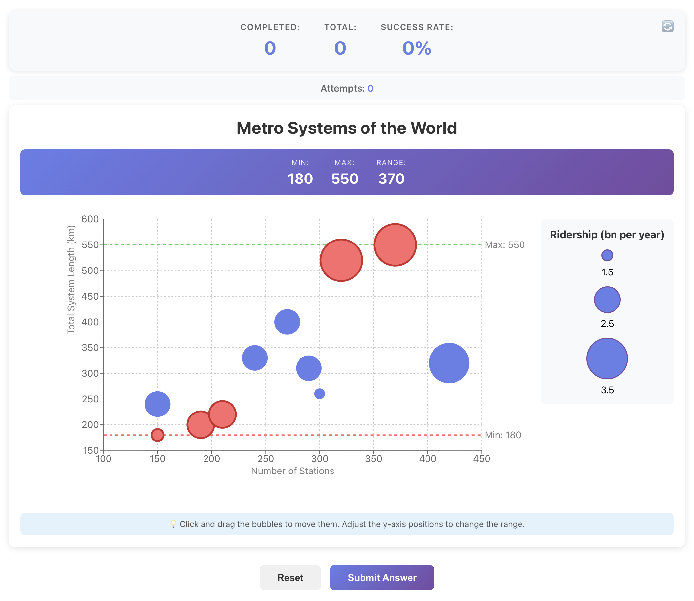

# Range Teaching App

A web application that teaches the concept of "Range" in data visualization through an interactive bubble graph.

## Live Demo

🌐 **Deployed Application**: [https://range-teaching-app.vercel.app/](https://range-teaching-app.vercel.app/)



## Tech Stack

- **Frontend**: React 18.2.0 with JSX components and CSS Modules
- **Backend**: Django 4.2.7 with Django REST Framework
- **Visualization**: Recharts 2.10.3
- **HTTP Client**: Axios

## Prerequisites

Before you begin, ensure you have the following installed:

- **Python** 3.8 or higher
- **Node.js** 14.x or higher and **npm** (or **yarn**)
- **Git** (for cloning the repository)

## Features

- Interactive bubble graph based on "Metro Systems of the World" example
- Drag-and-drop functionality to move data points along x and y axes
- Tutor component explaining the concept of Range
- Challenge system with 18 different range target types
- Real-time feedback on user submissions
- Beautiful, modern UI with gradient backgrounds
- Custom favicon matching the app theme

## Installation

### Quick Start

You can use the provided shell scripts for quick setup:

**Backend:**
```bash
./scripts/start_backend.sh
```

**Frontend (in a new terminal):**
```bash
./scripts/start_frontend.sh
```

### Manual Setup

#### Backend Setup

1. Navigate to the backend directory:
```bash
cd backend
```

2. Create a virtual environment (recommended):
```bash
python3 -m venv venv
source venv/bin/activate  # On Windows: venv\Scripts\activate
```

3. Install dependencies:
```bash
pip install -r requirements.txt
```

4. Create `.env` file for environment variables:
```bash
# Copy example file
cp ../.env.example .env
# Edit .env with your values (or use defaults)
```

5. Run migrations (creates tables for Django's built-in apps like sessions, auth, etc.):
```bash
python manage.py migrate
```

6. Start the Django server:
```bash
python manage.py runserver
```

The backend will be available at `http://localhost:8000`

**Note**: The `.env` file is optional. If not present, the app will use default values from `settings.py`.

#### Frontend Setup

1. Navigate to the frontend directory:
```bash
cd frontend
```

2. (Optional) Create `.env` file for environment variables:
```bash
# Create .env file
echo "REACT_APP_API_BASE_URL=http://localhost:8000/api" > .env
```

3. Install dependencies:
```bash
npm install
```

4. Start the React development server:
```bash
npm start
```

The frontend will be available at `http://localhost:3000`

**Note**: The `.env` file is optional. If not present, the app will use `http://localhost:8000/api` as default.

## Usage

1. Start both the backend and frontend servers
2. Open `http://localhost:3000` in your browser
3. Read the tutor section to understand what Range means
4. View the challenge and try to achieve the target range
5. Click and drag the bubbles to move them along the y-axis
6. Click "Submit Answer" to check if your range is correct
7. Get feedback and try again or start a new challenge

## API Endpoints

### Get Initial Graph Data
- **Endpoint**: `GET /api/data/`
- **Description**: Returns the initial graph data with all data points
- **Example Request**:
```bash
curl http://localhost:8000/api/data/
```
- **Example Response**:
```json
{
  "xAxisLabel": "Year",
  "yAxisLabel": "Number of Stations",
  "title": "Metro Systems of the World",
  "points": [
    {"id": 1, "name": "Tokyo", "x": 1927, "y": 285, "size": 304},
    ...
  ]
}
```

### Get Random Challenge
- **Endpoint**: `GET /api/challenge/`
- **Description**: Returns a randomly selected challenge
- **Example Request**:
```bash
curl http://localhost:8000/api/challenge/
```
- **Example Response**:
```json
{
  "type": "greater_than",
  "value": 300,
  "description": "Make the range greater than 300"
}
```

### Validate Range
- **Endpoint**: `POST /api/validate/`
- **Description**: Validates if the user's graph meets the challenge requirements
- **Request Body**:
```json
{
  "points": [
    {"id": 1, "name": "Tokyo", "x": 1927, "y": 250, "size": 304},
    {"id": 2, "name": "Seoul", "x": 1974, "y": 400, "size": 331}
  ],
  "challenge": {
    "type": "greater_than",
    "value": 300,
    "description": "Make the range greater than 300"
  }
}
```
- **Example Response**:
```json
{
  "is_correct": true,
  "feedback": "Your range is 150. Target: greater than 300. ✓ Correct!",
  "current_range": {
    "min": 250,
    "max": 400,
    "range": 150
  }
}
```

## Environment Variables

### Backend (.env in backend directory)

| Variable | Description | Default |
|----------|-------------|---------|
| `SECRET_KEY` | Django secret key for cryptographic signing | `django-insecure-dev-key-change-in-production` |
| `DEBUG` | Enable/disable debug mode | `True` |
| `ALLOWED_HOSTS` | Comma-separated list of allowed hostnames | `*` |
| `CORS_ALLOWED_ORIGINS` | Comma-separated list of CORS allowed origins | `http://localhost:3000,http://127.0.0.1:3000,https://range-teaching-app.vercel.app` |

### Frontend (.env in frontend directory)

| Variable | Description | Default |
|----------|-------------|---------|
| `REACT_APP_API_BASE_URL` | Base URL for API requests | `http://localhost:8000/api` |

## Project Structure

```
tt-schole-ai/
├── backend/
│   ├── api/
│   │   ├── views.py          
│   │   ├── urls.py          
│   │   ├── challenges.py     
│   │   └── graph_data.py     
│   ├── range_app/
│   │   ├── settings.py      
│   │   └── urls.py          
│   ├── manage.py
│   └── requirements.txt
├── frontend/
│   ├── public/
│   │   ├── index.html
│   │   └── favicon.svg     
│   ├── src/
│   │   ├── components/
│   │   │   ├── BubbleGraph.jsx
│   │   │   ├── BubbleGraph.module.css
│   │   │   ├── Tutor.jsx
│   │   │   ├── Tutor.module.css
│   │   │   ├── Feedback.jsx
│   │   │   └── Feedback.module.css
│   │   ├── App.jsx
│   │   ├── App.css
│   │   ├── index.js
│   │   └── index.css
│   └── package.json
├── scripts/
│   ├── start_backend.sh         
│   └── start_frontend.sh         
├── img/
│   └── demo-screenshot.png
└── README.md
```

## Challenge Types

The app supports 18 different challenge variations across four main types:

1. **Less Than** (5 variations): Make the range lower than a specified value (200, 250, 300, 350, 400)
2. **Greater Than** (5 variations): Make the range greater than a specified value (200, 250, 300, 350, 400)
3. **Between** (4 variations): Make the range between two values (100-500, 150-400, 200-450, 250-350)
4. **Exact** (4 variations): Make the range exactly match specified min and max values

Challenges are randomly selected from `backend/api/challenges.py` on each request.

## Code Organization

- **Data Separation**: Graph data and challenge types are stored in separate Python files (`graph_data.py`, `challenges.py`) for better organization
- **CSS Modules**: Component styles use CSS Modules (`.module.css`) for style isolation
- **JSX Components**: All React components use `.jsx` extension for clarity
- **Modular Structure**: Clean separation between frontend components and backend API

## Development Notes

- Backend uses Django REST Framework for API endpoints
- Frontend uses Recharts for bubble graph visualization
- CORS is configured to allow frontend-backend communication
- All styles are scoped to components using CSS Modules

## Troubleshooting

### Backend Issues

**Port 8000 already in use:**
```bash
# Find and kill the process using port 8000
lsof -ti:8000 | xargs kill -9
# Or use a different port
python manage.py runserver 8001
```

**ModuleNotFoundError or ImportError:**
- Ensure virtual environment is activated: `source venv/bin/activate`
- Reinstall dependencies: `pip install -r requirements.txt`

**Database migration errors:**
```bash
# Reset database (WARNING: deletes all data)
rm db.sqlite3
python manage.py migrate
```

### Frontend Issues

**Port 3000 already in use:**
```bash
# React will automatically suggest using another port
# Or set PORT environment variable
PORT=3001 npm start
```

**API connection errors:**
- Verify backend is running on `http://localhost:8000`
- Check `REACT_APP_API_BASE_URL` in `.env` file
- Ensure CORS is properly configured in Django settings

**npm install fails:**
```bash
# Clear npm cache and reinstall
rm -rf node_modules package-lock.json
npm cache clean --force
npm install
```

### CORS Issues

If you encounter CORS errors when connecting frontend to backend:
- Add your frontend URL to `CORS_ALLOWED_ORIGINS` in backend `.env`
- Ensure backend `ALLOWED_HOSTS` includes your domain
- Restart both servers after changing environment variables
